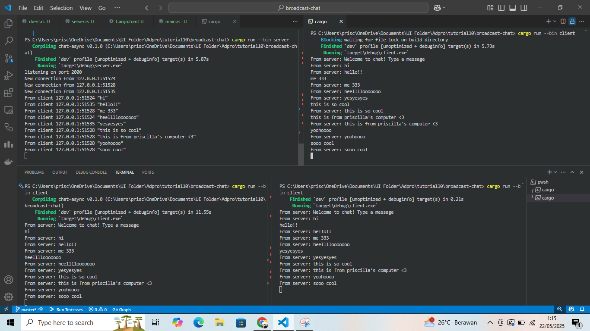

# Advprog Tutorial 10 - Timer
## Priscilla Natanael Surjanto - 2306152153

### 2.1 Original code of the broadcast chat

Cara menjalankan:
1. Buka 4 terminal, semua terminal harus ada pada direktori proyek
2. Jangan lupa masukkan direktori bin ke `Cargo.toml`
3. Jalankan `cargo run --bin server` pada satu terminal
4. Jalankan `cargo run --bin client` pada 3 terminal lainnya
5. Mulai coba kirimkan pesan melalui terminal client

Ketika satu terminal client mengetik sebuah pesan lalu menekan enter, pesan ini akan dikirimkan ke server lalu dicetak pada terminal server. Server kemudian akan mengirimkan pesan tersebut ke semua client, dan pesan akan dicetak di semua terminal client. Ini berlaku pada terminal client manapun.

### 2.2 Modifying the websocket port
Di sisi server dalam file `server.rs`, perubahan dilakukan pada `TcpListener` yang mengikat/bind ke alamat `127.0.0.1:8080`. Sedangkan di sisi `client.rs`, URI koneksi diubah menjadi `ws://127.0.0.1:8080` agar klien dapat terhubung ke server dengan port yang sesuai. Mengenai protokol websocket, pada klien terlihat jelas dengan penggunaan skema `ws://` pada URI koneksi. Sementara pada server, protokol websocket tidak dideklarasikan secara langsung tetapi diimplementasikan melalui penggunaan crate `tokio_websockets`. Server pertama menerima koneksi TCP biasa melalui `TcpListener`, kemudian menggunakan `ServerBuilder` untuk mengubah koneksi TCP tersebut menjadi `WebSocketStream`. Proses handshake websocket ditangani secara internal oleh `ServerBuilder` saat method `accept()` dipanggil. Komunikasi antara kedua sisi menggunakan tipe `Message` dari `tokio_websockets` yang memungkinkan pengiriman pesan teks melalui protokol websocket. Server juga mengimplementasikan sistem broadcast menggunakan `tokio::sync::broadcast` yang memungkinkan pesan dari satu klien diteruskan ke semua klien lain yang terhubung.